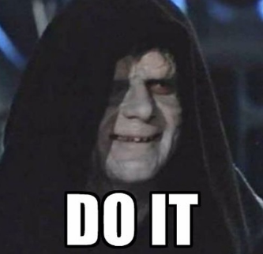

# Feuille de route - Run #2
Libre à vous d'utiliser cette feuille de route comme il vous semble. Nous conseillons de lire toutes les ➡️ indications et astuces avant de vous lancer dans cette seconde aventure ! Gardez les ⚠️ indices pour quand vous pensez en avoir vraiment besoin. Nous sommes disponibles au 08 36 65 65 65.

  
✅ Indication I

  
  

    
⚠️ Indice

    N'as-tu jamais voulu être un petit oeuf ?
  

  
✅ Indication II

  
  

    
⚠️ Indice

    Cherche un autre accès au feu de Noiresouche et d’autres chemins s’ouvriront à toi.
  

  
✅ Indication III

  
  

    
⚠️ Indice

    Toc Toc ?
  

  
➡️ Indication IV

  

  
✅ Indication V

  Le très grand tableau n’est pas un Picasso.

  
➡️ Indication VI 🆕

  
  

    
⚠️ Indice 1

    Gwenevere est trop belle pour être vraie.
  

  

    
⚠️ Indice 2

     ? --> Tu montes ou tu descends ?
  

  

    
⚠️ Indice 3 🆕

     
  

  
➡️ Accès DLC

   
  Note: Quitout après l’hydre.

  
➡️ Astuce I

  La lecture des items est parfois primordiale.

  
➡️ Astuce II

  Le jeu récompense souvent l'observation.

  
➡️ Astuce III 🆕

  git gud :)

